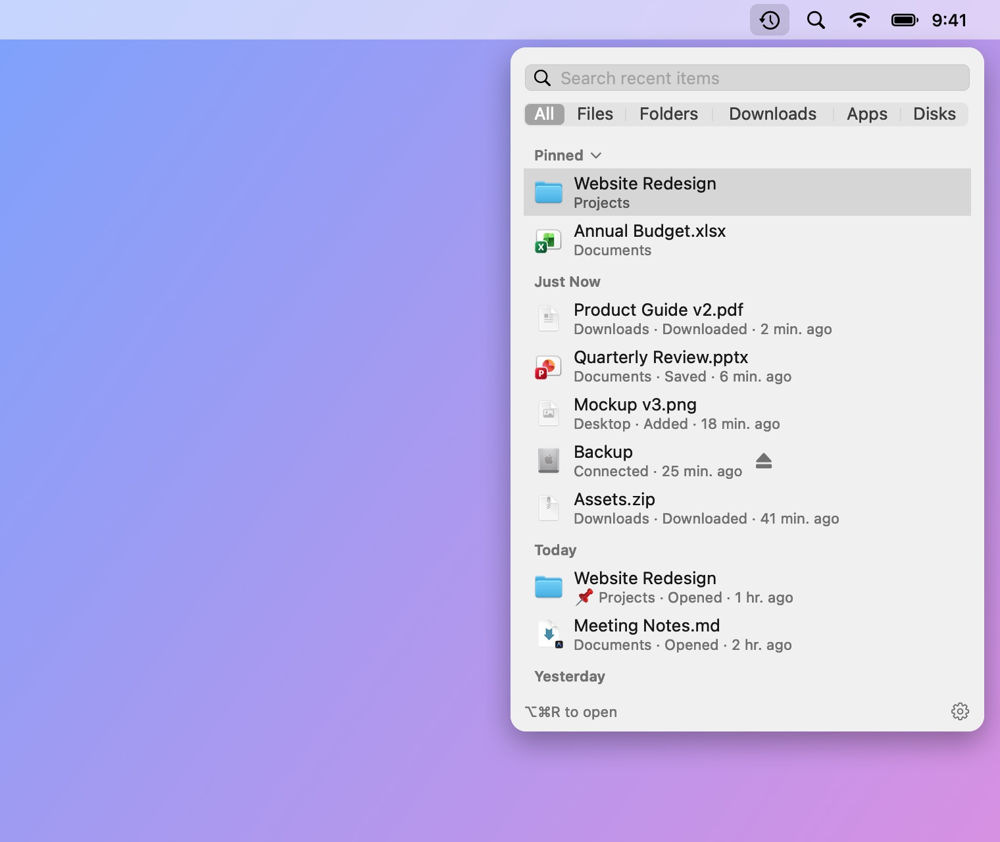
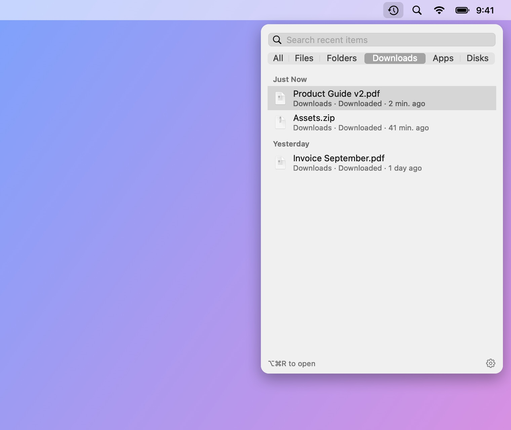
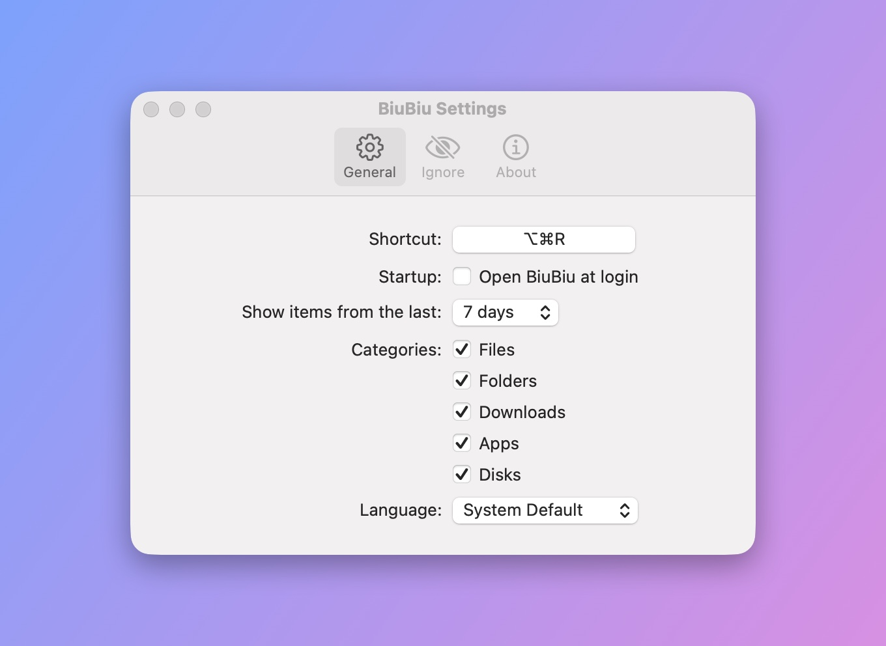

# BiuBiu

**English** · [简体中文](README_CN.md) · [繁體中文](README_TW.md) · [日本語](README_JA.md) · [한국어](README_KO.md) · [Deutsch](README_DE.md) · [Français](README_FR.md) · [Español](README_ES.md) · [Português (Brasil)](README_PT-BR.md) · [Русский](README_RU.md)

BiuBiu is a menu bar app for macOS that shows the files and folders you recently opened, saved or downloaded, plus newly installed apps and connected drives. Press `⌥⌘R` (configurable) anywhere, including full-screen apps.

- Built on the Spotlight index; everything stays on your Mac
- Click to open, `⌘↩` to show in Finder, Space or `⌘Y` to Quick Look, or drag items into other apps
- Pin favorites; ignore files, folders or extensions you never want to see

<p align="center"></p>

<p align="center">
  
  
</p>

The files in these screenshots are made-up demo data rendered by `scripts/make-screenshots.sh`.

## Install

1. Download `BiuBiu-<version>.zip` from [Releases](../../releases/latest) and unzip it.
2. Move `BiuBiu.app` to Applications.
3. The first launch is blocked because BiuBiu is not signed with a paid Apple Developer ID. Click Done, open System Settings → Privacy & Security, scroll down to BiuBiu and click “Open Anyway”.

   Or run: `xattr -dr com.apple.quarantine /Applications/BiuBiu.app`

4. When macOS asks whether BiuBiu can access your Desktop, Documents and Downloads folders, click Allow, or their files won’t appear in the list. If you clicked Don’t Allow, click the orange note at the top of the panel to turn access on in System Settings.

Every release is signed with the same self-signed certificate, so updates keep the permissions you granted.

## Requirements

macOS 14 or later, Apple silicon or Intel.

## Languages

BiuBiu follows your system language and falls back to English. Supported: English, 简体中文, 繁體中文, 日本語, 한국어, Deutsch, Français, Español, Português (Brasil), Русский. To use a different one, pick it in Settings → General → Language.

## If the list is empty

BiuBiu relies on Spotlight. Check System Settings → Spotlight and make sure your home folder is not excluded from search.

## Building from source

Command Line Tools are enough (`xcode-select --install`); Xcode is not required.

```bash
swift run BiuBiuTestRunner   # run the tests
swift run BiuBiu             # run it directly (English UI, no bundle)
swift run BiuBiu --dump      # print what Spotlight currently finds
scripts/build-app.sh         # package dist/BiuBiu.app and a zip (ad-hoc signed)
```

## Maintainers

- Every release must be signed with the same self-signed certificate, or upgrades lose granted permissions. Create it once with `scripts/create-signing-cert.sh <dir outside the repo>` (needs OpenSSL 3: `brew install openssl@3`) and back up the `.p12` and its password. Its fingerprint lives in `Resources/signing-certificate-sha1.txt`; the release workflow checks it.
- GitHub secrets: `SIGNING_P12_BASE64` (the `.p12`, base64) and `SIGNING_P12_PASSWORD`.
- Release: push a `vX.Y.Z` tag on `main`; `release.yml` tests, signs, and publishes `BiuBiu-X.Y.Z.zip`.
- Screenshots: `scripts/make-screenshots.sh` renders the UI offscreen from made-up demo files into `docs/images/`, one set per language (your terminal needs Screen Recording permission and the display must be awake).
- Translations live in `Resources/<language>.lproj/`. A test fails if any language misses a string or changes its placeholders.

## License

MIT
