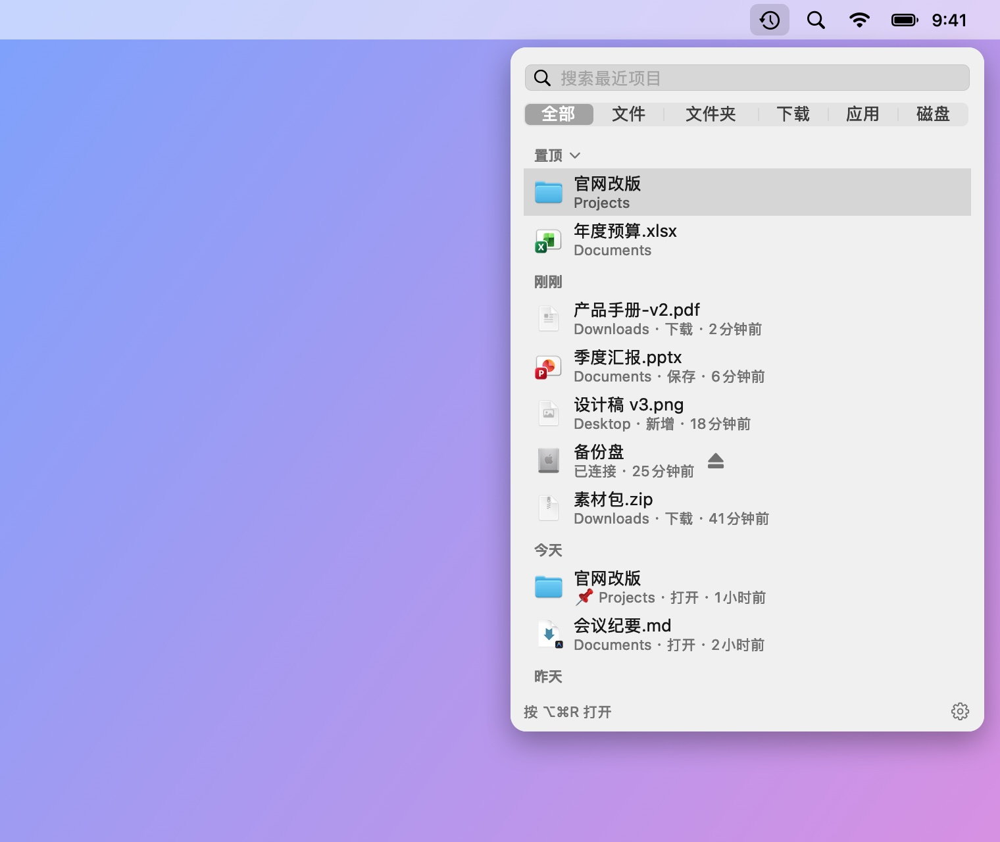
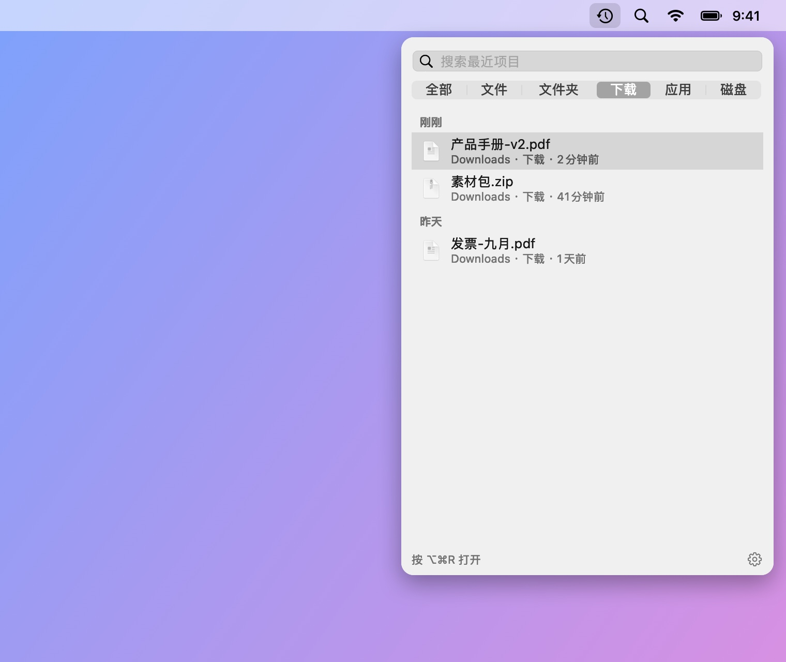
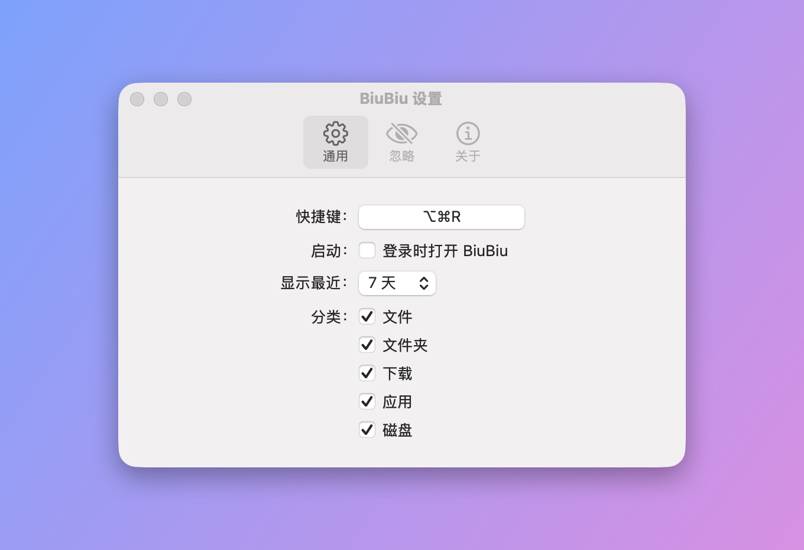

# BiuBiu

[English](#english) · 中文

BiuBiu 是一个常驻 macOS 菜单栏的近期文件快速访问工具。按下快捷键（默认 `⌥⌘R`），就能看到最近打开、保存、下载的文件和文件夹，以及最近安装的应用和刚接上的外置磁盘。全屏应用里也能唤出。

- 基于 Spotlight 索引，全部在本地处理，不联网
- 单击打开；`⌘↩` 在 Finder 中显示；空格或 `⌘Y` 快速预览；直接拖到其他 app
- 置顶常用的文件和文件夹；把不想看到的文件、文件夹或扩展名加入忽略列表

<p align="center"></p>

<p align="center">
  
  
</p>

截图中的文件均为虚构的演示数据，由 `scripts/make-screenshots.sh` 生成。

## 安装

1. 从 [Releases](../../releases/latest) 下载 `BiuBiu-<版本>.zip` 并解压。
2. 把 `BiuBiu.app` 拖进"应用程序"文件夹。
3. 第一次打开时，macOS 会提示"无法验证开发者"（BiuBiu 没有使用付费的 Apple 开发者证书）。点"完成"，然后打开"系统设置 → 隐私与安全性"，在页面底部找到 BiuBiu，点"仍要打开"并输入密码确认。

   也可以在终端里执行：`xattr -dr com.apple.quarantine /Applications/BiuBiu.app`

之后的版本都使用同一张自签名证书，升级不会丢失已授予的权限。

## 系统要求

macOS 14 或更高版本，Apple 芯片或 Intel。

## 如果列表是空的

BiuBiu 依赖 Spotlight。请在"系统设置 → Spotlight"中确认主文件夹没有被排除在搜索之外。

## 从源码构建

只需要 Command Line Tools（`xcode-select --install`），不需要 Xcode。

```bash
swift run BiuBiuTestRunner   # 运行测试
swift run BiuBiu             # 直接运行（界面为英文，没有本地化资源）
swift run BiuBiu --dump      # 打印 Spotlight 当前找到的最近项目
scripts/build-app.sh         # 打包 dist/BiuBiu.app 和 zip（临时签名）
```

## 维护者说明

- **签名证书**：每个版本都必须用同一张自签名证书签名，否则用户升级后系统会把它当成另一个 app，已授予的权限会失效。证书只创建一次：`scripts/create-signing-cert.sh <仓库之外的目录>`（需要 OpenSSL 3，`brew install openssl@3`）。请备份生成的 `.p12` 和密码。证书指纹记录在 `Resources/signing-certificate-sha1.txt`，发布工作流会核对。
- **GitHub secrets**：`SIGNING_P12_BASE64`（`.p12` 的 base64）和 `SIGNING_P12_PASSWORD`。
- **发布**：在 `main` 上打 `vX.Y.Z` 标签并推送，`release.yml` 会测试、签名打包并发布 `BiuBiu-X.Y.Z.zip`。
- **截图**：`scripts/make-screenshots.sh` 用虚构的演示文件在屏幕外渲染界面，重新生成 `docs/images/` 里的中英文截图（需要终端有"屏幕录制"权限、显示器处于唤醒状态）。

## 许可

MIT

---

## English

BiuBiu is a menu bar app for macOS that shows the files and folders you recently opened, saved or downloaded, plus newly installed apps and connected drives. Press `⌥⌘R` (configurable) anywhere, including full-screen apps.

- Built on the Spotlight index; everything stays on your Mac
- Click to open, `⌘↩` to show in Finder, Space or `⌘Y` to Quick Look, or drag items into other apps
- Pin favorites; ignore files, folders or extensions you never want to see

<p align="center"></p>

<p align="center">
  
  
</p>

The files in these screenshots are made-up demo data rendered by `scripts/make-screenshots.sh`.

### Install

1. Download `BiuBiu-<version>.zip` from [Releases](../../releases/latest) and unzip it.
2. Move `BiuBiu.app` to Applications.
3. The first launch is blocked because BiuBiu is not signed with a paid Apple Developer ID. Click Done, open System Settings → Privacy & Security, scroll down to BiuBiu and click "Open Anyway".

   Or run: `xattr -dr com.apple.quarantine /Applications/BiuBiu.app`

Every release is signed with the same self-signed certificate, so updates keep the permissions you granted.

### Requirements

macOS 14 or later, Apple silicon or Intel.

### Building from source

Command Line Tools are enough (`xcode-select --install`); Xcode is not required. See the commands above.

### Maintainers

- Every release must be signed with the same self-signed certificate, or upgrades lose granted permissions. Create it once with `scripts/create-signing-cert.sh <dir outside the repo>` (needs OpenSSL 3: `brew install openssl@3`) and back up the `.p12` and its password. Its fingerprint lives in `Resources/signing-certificate-sha1.txt`; the release workflow checks it.
- GitHub secrets: `SIGNING_P12_BASE64` (the `.p12`, base64) and `SIGNING_P12_PASSWORD`.
- Release: push a `vX.Y.Z` tag on `main`; `release.yml` tests, signs, and publishes `BiuBiu-X.Y.Z.zip`.
- Screenshots: `scripts/make-screenshots.sh` renders the UI offscreen from made-up demo files into `docs/images/` (your terminal needs Screen Recording permission and the display must be awake).

### License

MIT
