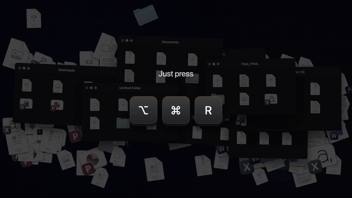
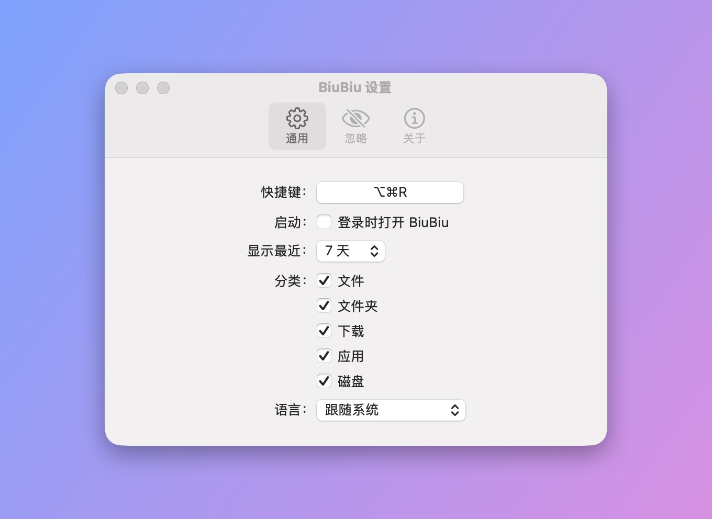

# BiuBiu

[English](README.md) · **简体中文** · [繁體中文](README_TW.md) · [日本語](README_JA.md) · [한국어](README_KO.md) · [Deutsch](README_DE.md) · [Français](README_FR.md) · [Español](README_ES.md) · [Português (Brasil)](README_PT-BR.md) · [Русский](README_RU.md)

BiuBiu 是一个常驻 macOS 菜单栏的近期文件快速访问工具。按下快捷键（默认 `⌥⌘R`），就能看到最近打开、保存、下载的文件和文件夹，以及最近打开或安装的应用和刚接上的外置磁盘。全屏应用里也能唤出。

- 基于 Spotlight 索引，全部在本地处理，不联网
- 单击打开；`⌘↩` 在 Finder 中显示；空格或 `⌘Y` 快速预览；直接拖到其他 app
- 置顶常用的文件和文件夹；把不想看到的文件、文件夹或扩展名加入忽略列表

<p align="center"></p>

完整视频（英文，有声音，55 秒）：

https://github.com/user-attachments/assets/1c2f0163-6016-40a7-a11d-a75bfeea4a53

<p align="center"></p>

<p align="center">
  
  
</p>

截图中的文件均为虚构的演示数据，由 `scripts/make-screenshots.sh` 生成。

## 安装

1. 从 [Releases](../../releases/latest) 下载 `BiuBiu-<版本>.zip` 并解压。
2. 把 `BiuBiu.app` 拖进“应用程序”文件夹。
3. 第一次打开时，macOS 会提示“无法验证开发者”（BiuBiu 没有使用付费的 Apple 开发者证书）。点“完成”，然后打开“系统设置 → 隐私与安全性”，在页面底部找到 BiuBiu，点“仍要打开”并输入密码确认。

   也可以在终端里执行： `xattr -dr com.apple.quarantine /Applications/BiuBiu.app`

4. macOS 询问是否允许 BiuBiu 访问“桌面”“文稿”“下载”文件夹时，请点“允许”，否则这些文件夹里的文件不会出现在列表中。如果点了“不允许”，可以点击面板顶部的橙色提示，到系统设置里打开。

之后的版本都使用同一张自签名证书，升级不会丢失已授予的权限。

## 系统要求

macOS 14 或更高版本，Apple 芯片或 Intel。

## 语言

BiuBiu 跟随系统语言，系统语言不受支持时显示英文。支持：English, 简体中文, 繁體中文, 日本語, 한국어, Deutsch, Français, Español, Português (Brasil), Русский。想用其他语言，可在“设置 → 通用 → 语言”中选择。

## 如果列表是空的

BiuBiu 依赖 Spotlight。请在“系统设置 → Spotlight”中确认主文件夹没有被排除在搜索之外。

## 从源码构建

只需要 Command Line Tools（`xcode-select --install`），不需要 Xcode。

```bash
swift run BiuBiuTestRunner   # 运行测试
swift run BiuBiu             # 直接运行（界面为英文，没有 app 包）
swift run BiuBiu --dump      # 打印 Spotlight 当前找到的最近项目
scripts/build-app.sh         # 打包 dist/BiuBiu.app 和 zip（临时签名）
```

## 维护者说明

- **签名证书**：每个版本都必须用同一张自签名证书签名，否则用户升级后系统会把它当成另一个 app，已授予的权限会失效。证书只创建一次：`scripts/create-signing-cert.sh <仓库之外的目录>`（需要 OpenSSL 3，`brew install openssl@3`）。请备份生成的 `.p12` 和密码。证书指纹记录在 `Resources/signing-certificate-sha1.txt`，发布工作流会核对。
- **GitHub secrets**：`SIGNING_P12_BASE64`（`.p12` 的 base64）和 `SIGNING_P12_PASSWORD`。
- **发布**：在 `main` 上打 `vX.Y.Z` 标签并推送，`release.yml` 会测试、签名打包并发布 `BiuBiu-X.Y.Z.zip`。
- **截图**：`scripts/make-screenshots.sh` 用虚构的演示文件在屏幕外渲染界面，为每种语言生成一套截图到 `docs/images/`（需要终端有“屏幕录制”权限、显示器处于唤醒状态）。
- **翻译**：在 `Resources/<语言>.lproj/` 中。任何语言缺少条目或占位符不一致，测试都会失败。

## 许可

MIT
