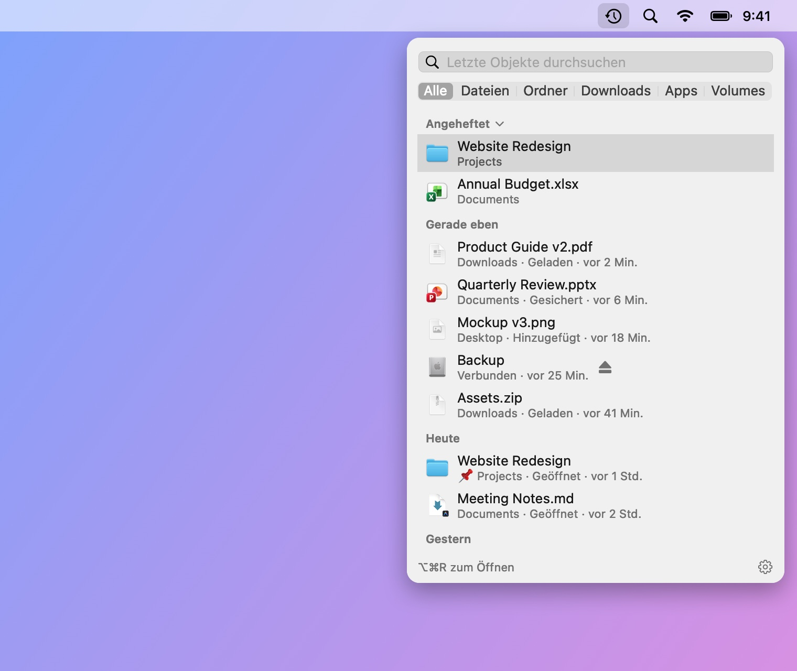
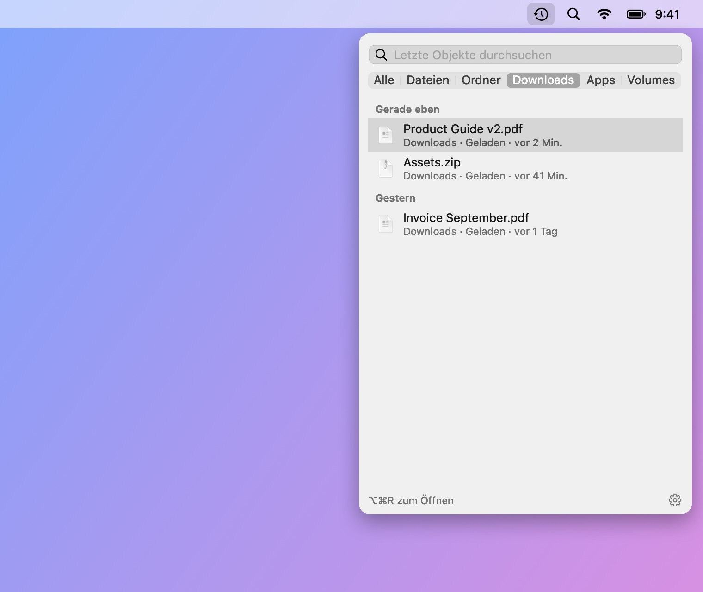
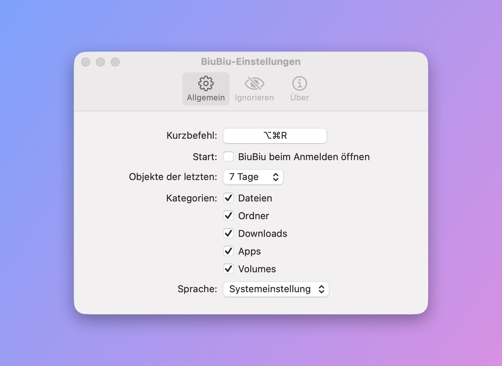

# BiuBiu

[English](README.md) · [简体中文](README_CN.md) · [繁體中文](README_TW.md) · [日本語](README_JA.md) · [한국어](README_KO.md) · **Deutsch** · [Français](README_FR.md) · [Español](README_ES.md) · [Português (Brasil)](README_PT-BR.md) · [Русский](README_RU.md)

BiuBiu ist eine Menüleisten-App für macOS, die die Dateien und Ordner zeigt, die du zuletzt geöffnet, gesichert oder geladen hast – dazu neu installierte Apps und angeschlossene Volumes. Drücke überall `⌥⌘R` (anpassbar), auch in Apps im Vollbildmodus.

- Basiert auf dem Spotlight-Index; alles bleibt auf deinem Mac
- Klicken zum Öffnen, `⌘↩` zum Zeigen im Finder, Leertaste oder `⌘Y` für die Übersicht, oder Objekte direkt in andere Apps ziehen
- Favoriten anheften; Dateien, Ordner oder Endungen ignorieren, die du nie sehen willst

<p align="center"></p>

<p align="center">
  
  
</p>

Die Dateien auf diesen Bildschirmfotos sind erfundene Demo-Daten, erzeugt mit `scripts/make-screenshots.sh`.

## Installation

1. Lade `BiuBiu-<Version>.zip` unter [Releases](../../releases/latest) und entpacke es.
2. Bewege `BiuBiu.app` in den Ordner „Programme“.
3. Der erste Start wird blockiert, weil BiuBiu nicht mit einer kostenpflichtigen Apple Developer ID signiert ist. Klicke auf „Fertig“, öffne Systemeinstellungen → Datenschutz & Sicherheit, scrolle zu BiuBiu und klicke auf „Dennoch öffnen“.

   Oder im Terminal: `xattr -dr com.apple.quarantine /Applications/BiuBiu.app`

Alle Versionen sind mit demselben selbstsignierten Zertifikat signiert; Updates behalten die erteilten Berechtigungen.

## Systemvoraussetzungen

macOS 14 oder neuer, Apple Silicon oder Intel.

## Sprachen

BiuBiu folgt der Systemsprache und nutzt sonst Englisch. Unterstützt: English, 简体中文, 繁體中文, 日本語, 한국어, Deutsch, Français, Español, Português (Brasil), Русский. Eine andere Sprache wählst du unter Einstellungen → Allgemein → Sprache.

## Wenn die Liste leer ist

BiuBiu nutzt Spotlight. Prüfe unter Systemeinstellungen → Spotlight, dass dein Benutzerordner nicht von der Suche ausgeschlossen ist.

## Aus dem Quellcode bauen

Die Command Line Tools reichen (`xcode-select --install`); Xcode wird nicht benötigt.

```bash
swift run BiuBiuTestRunner   # Tests ausführen
swift run BiuBiu             # direkt starten (englische Oberfläche, ohne App-Bundle)
swift run BiuBiu --dump      # zeigen, was Spotlight gerade findet
scripts/build-app.sh         # dist/BiuBiu.app und ein zip bauen (Ad-hoc-signiert)
```

## Für Maintainer

Hinweise für Maintainer findest du in der [englischen README](README.md#maintainers).

## Lizenz

MIT
