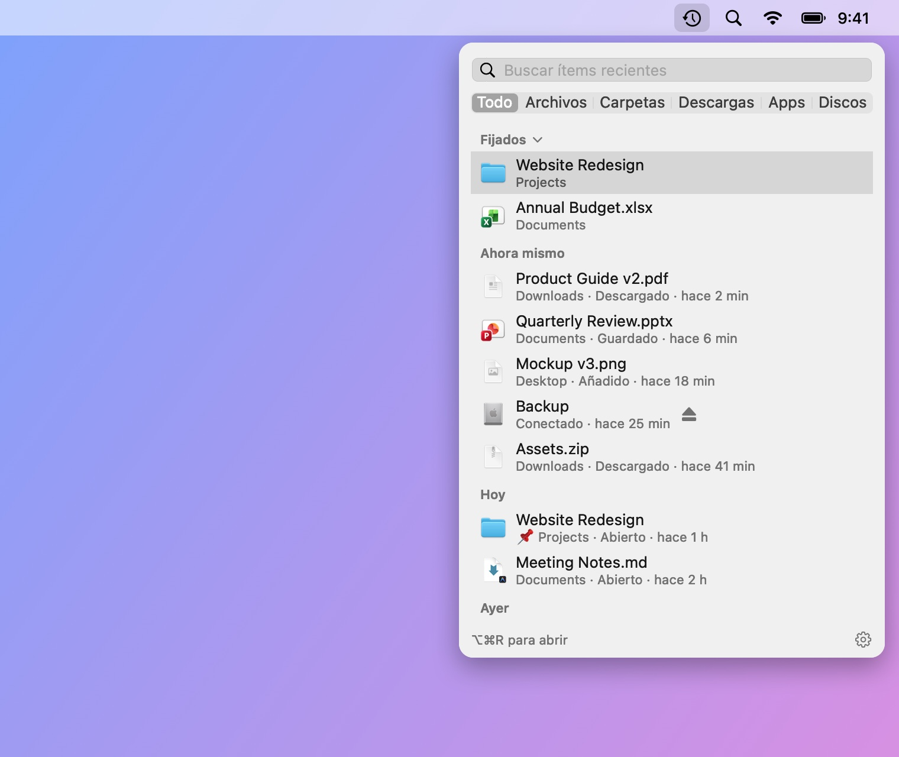
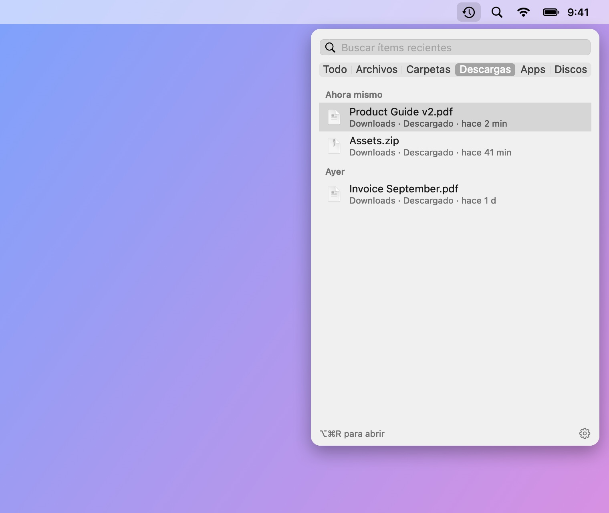
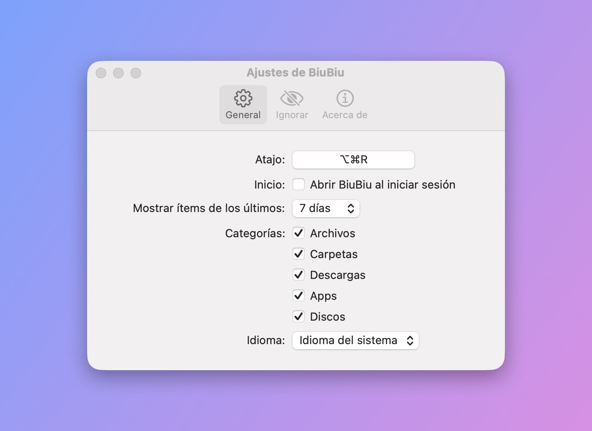

# BiuBiu

[English](README.md) · [简体中文](README_CN.md) · [繁體中文](README_TW.md) · [日本語](README_JA.md) · [한국어](README_KO.md) · [Deutsch](README_DE.md) · [Français](README_FR.md) · **Español** · [Português (Brasil)](README_PT-BR.md) · [Русский](README_RU.md)

BiuBiu es una app de la barra de menús para macOS que muestra los archivos y carpetas que acabas de abrir, guardar o descargar, además de las apps instaladas hace poco y los discos conectados. Pulsa `⌥⌘R` (configurable) en cualquier lugar, incluso en apps a pantalla completa.

- Se basa en el índice de Spotlight; todo se queda en tu Mac
- Haz clic para abrir, `⌘↩` para mostrar en el Finder, Espacio o `⌘Y` para la vista rápida, o arrastra a otras apps
- Fija tus favoritos; ignora archivos, carpetas o extensiones que no quieras ver nunca

<p align="center"></p>

<p align="center">
  
  
</p>

Los archivos de estas capturas son datos de demostración inventados, generados con `scripts/make-screenshots.sh`.

## Instalación

1. Descarga `BiuBiu-<versión>.zip` desde [Releases](../../releases/latest) y descomprímelo.
2. Mueve `BiuBiu.app` a la carpeta Aplicaciones.
3. La primera apertura se bloquea porque BiuBiu no está firmado con un Apple Developer ID de pago. Haz clic en OK, abre Ajustes del Sistema → Privacidad y seguridad, baja hasta BiuBiu y haz clic en «Abrir igualmente».

   O ejecuta en el Terminal: `xattr -dr com.apple.quarantine /Applications/BiuBiu.app`

Todas las versiones se firman con el mismo certificado autofirmado, así que al actualizar se conservan los permisos concedidos.

## Requisitos

macOS 14 o posterior, Apple silicon o Intel.

## Idiomas

BiuBiu sigue el idioma del sistema y, si no es compatible, usa el inglés. Compatibles: English, 简体中文, 繁體中文, 日本語, 한국어, Deutsch, Français, Español, Português (Brasil), Русский. Para usar otro, elígelo en Ajustes → General → Idioma.

## Si la lista está vacía

BiuBiu se apoya en Spotlight. Comprueba en Ajustes del Sistema → Spotlight que tu carpeta de inicio no está excluida de la búsqueda.

## Compilar desde el código

Bastan las Command Line Tools (`xcode-select --install`); no hace falta Xcode.

```bash
swift run BiuBiuTestRunner   # ejecutar las pruebas
swift run BiuBiu             # ejecutar directamente (interfaz en inglés, sin paquete de app)
swift run BiuBiu --dump      # mostrar lo que Spotlight encuentra ahora
scripts/build-app.sh         # crear dist/BiuBiu.app y un zip (firma ad hoc)
```

## Para mantenedores

Las notas para mantenedores están en el [README en inglés](README.md#maintainers).

## Licencia

MIT
