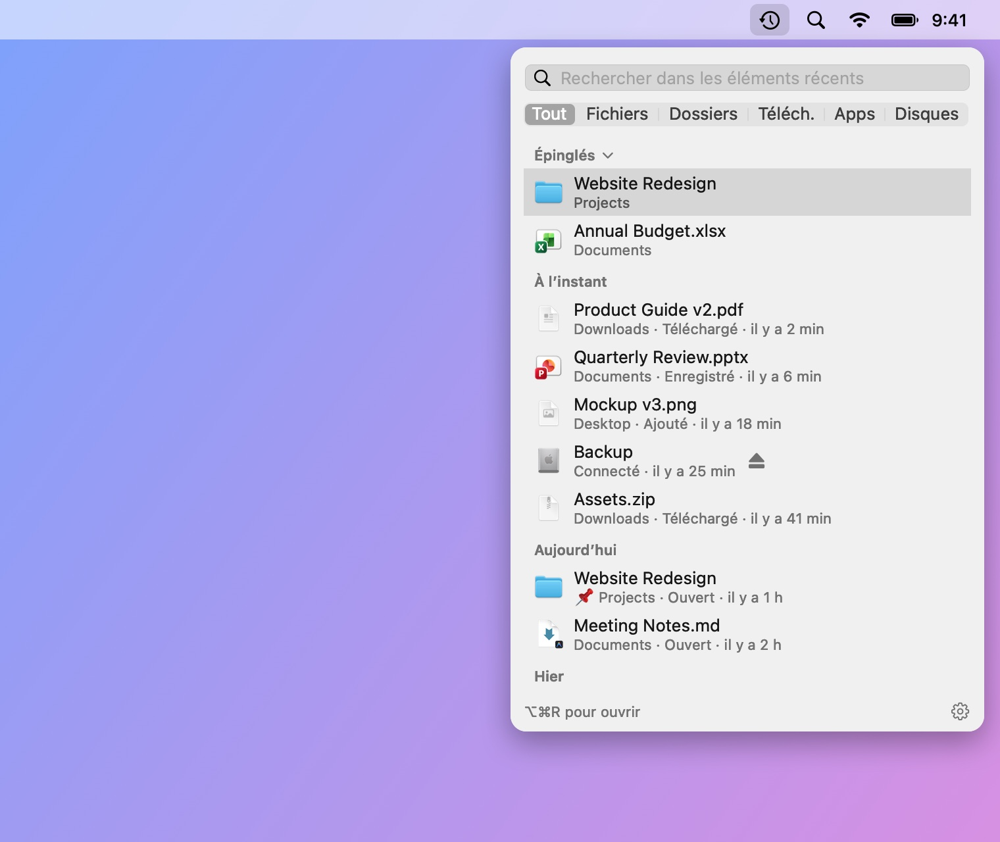
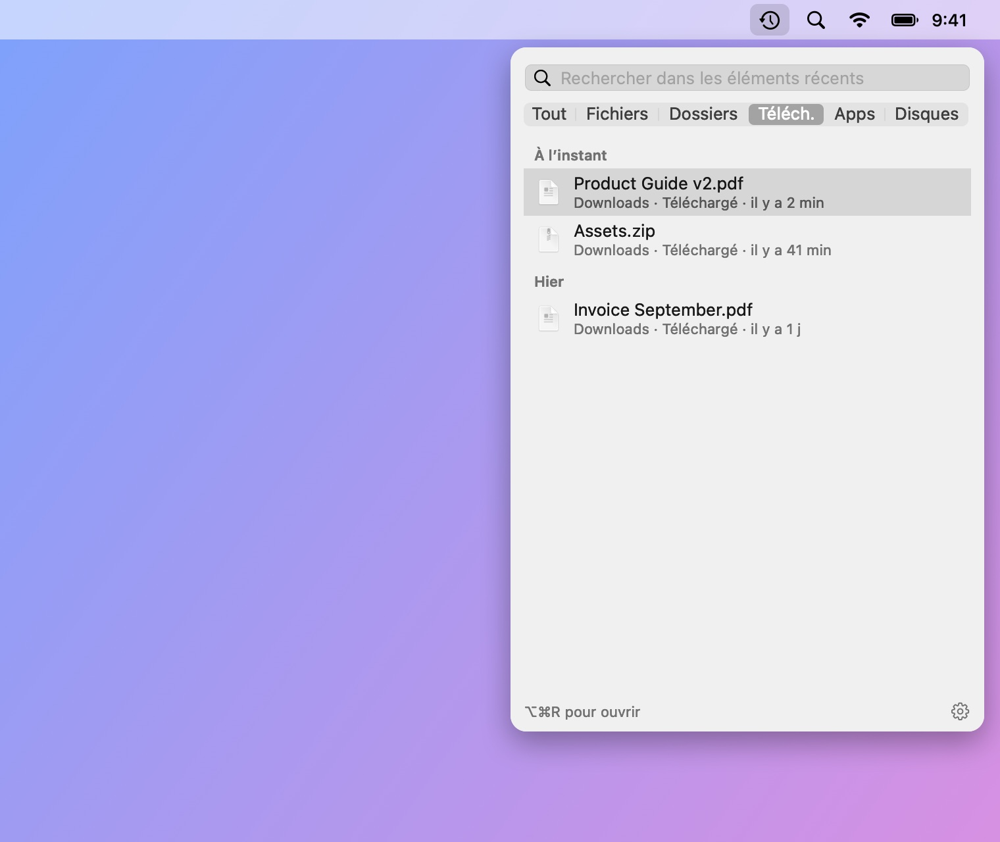
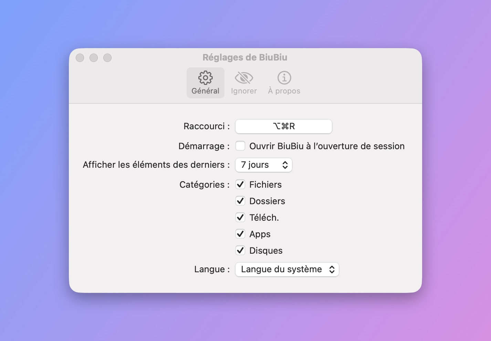

# BiuBiu

[English](README.md) · [简体中文](README_CN.md) · [繁體中文](README_TW.md) · [日本語](README_JA.md) · [한국어](README_KO.md) · [Deutsch](README_DE.md) · **Français** · [Español](README_ES.md) · [Português (Brasil)](README_PT-BR.md) · [Русский](README_RU.md)

BiuBiu est une app de la barre des menus pour macOS qui affiche les fichiers et dossiers que vous venez d’ouvrir, d’enregistrer ou de télécharger, ainsi que les apps récemment installées et les disques connectés. Appuyez sur `⌥⌘R` (modifiable) n’importe où, même dans une app en plein écran.

- Repose sur l’index Spotlight ; tout reste sur votre Mac
- Cliquez pour ouvrir, `⌘↩` pour afficher dans le Finder, Espace ou `⌘Y` pour Coup d’œil, ou faites glisser vers d’autres apps
- Épinglez vos favoris ; ignorez les fichiers, dossiers ou extensions que vous ne voulez jamais voir

<p align="center"></p>

<p align="center">
  
  
</p>

Les fichiers de ces captures sont des données de démonstration fictives générées par `scripts/make-screenshots.sh`.

## Installation

1. Téléchargez `BiuBiu-<version>.zip` depuis les [Releases](../../releases/latest) et décompressez-le.
2. Placez `BiuBiu.app` dans le dossier Applications.
3. Le premier lancement est bloqué car BiuBiu n’est pas signé avec un identifiant Apple Developer payant. Cliquez sur Terminé, ouvrez Réglages Système → Confidentialité et sécurité, descendez jusqu’à BiuBiu et cliquez sur « Ouvrir quand même ».

   Ou dans le Terminal : `xattr -dr com.apple.quarantine /Applications/BiuBiu.app`

Chaque version est signée avec le même certificat auto-signé : les mises à jour conservent les autorisations accordées.

## Configuration requise

macOS 14 ou ultérieur, Apple silicon ou Intel.

## Langues

BiuBiu suit la langue du système et utilise l’anglais sinon. Langues prises en charge : English, 简体中文, 繁體中文, 日本語, 한국어, Deutsch, Français, Español, Português (Brasil), Русский. Pour en choisir une autre, allez dans Réglages → Général → Langue.

## Si la liste est vide

BiuBiu s’appuie sur Spotlight. Vérifiez dans Réglages Système → Spotlight que votre dossier de départ n’est pas exclu de la recherche.

## Compiler depuis les sources

Les Command Line Tools suffisent (`xcode-select --install`) ; Xcode n’est pas nécessaire.

```bash
swift run BiuBiuTestRunner   # lancer les tests
swift run BiuBiu             # lancer directement (interface en anglais, sans bundle)
swift run BiuBiu --dump      # afficher ce que Spotlight trouve actuellement
scripts/build-app.sh         # créer dist/BiuBiu.app et un zip (signature ad hoc)
```

## Pour les mainteneurs

Les notes pour les mainteneurs sont dans le [README en anglais](README.md#maintainers).

## Licence

MIT
