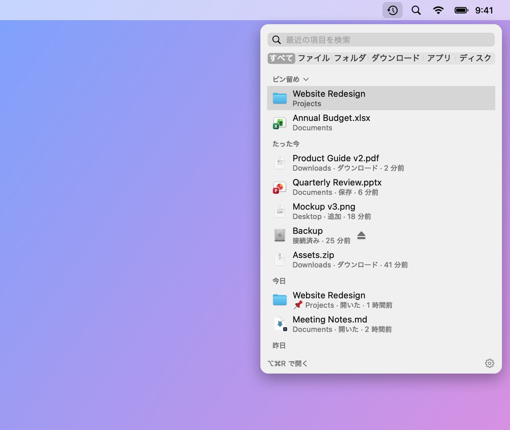
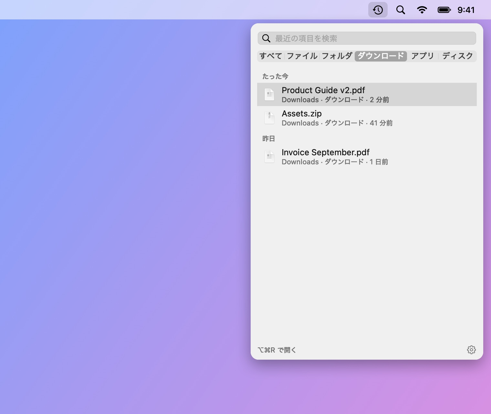
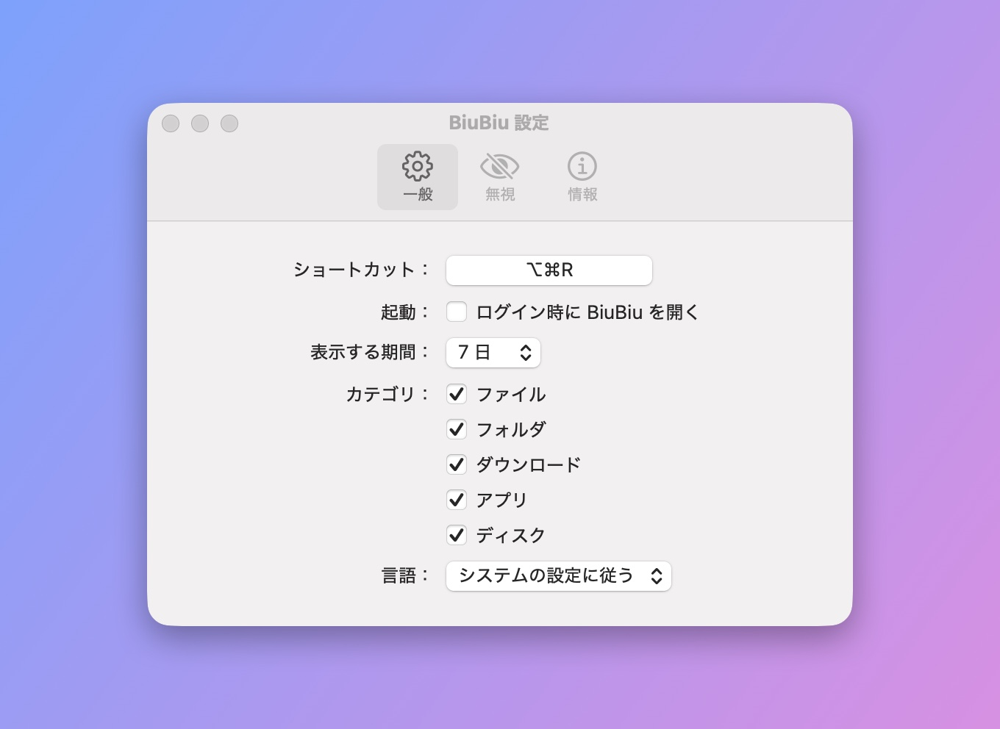

# BiuBiu

[English](README.md) · [简体中文](README_CN.md) · [繁體中文](README_TW.md) · **日本語** · [한국어](README_KO.md) · [Deutsch](README_DE.md) · [Français](README_FR.md) · [Español](README_ES.md) · [Português (Brasil)](README_PT-BR.md) · [Русский](README_RU.md)

BiuBiu は macOS のメニューバーに常駐する、最近のファイルにすばやくアクセスするためのアプリです。ショートカット（デフォルトは `⌥⌘R`）を押すと、最近開いた・保存した・ダウンロードしたファイルとフォルダ、最近開いた・インストールしたアプリ、接続したばかりの外部ディスクが表示されます。フルスクリーンのアプリからも呼び出せます。

- Spotlight のインデックスを利用し、すべて Mac 内で処理。ネットワークは使いません
- クリックで開く、`⌘↩` で Finder に表示、スペースまたは `⌘Y` でクイックルック、ほかのアプリへそのままドラッグ
- よく使うファイルやフォルダをピン留め。見たくないファイル・フォルダ・拡張子は無視リストへ

<p align="center"></p>

フル動画（英語・音声あり・55 秒）：

https://github.com/user-attachments/assets/1c2f0163-6016-40a7-a11d-a75bfeea4a53

<p align="center"></p>

<p align="center">
  
  
</p>

スクリーンショットのファイルはすべて架空のデモデータで、`scripts/make-screenshots.sh` で生成しています。

## インストール

1. [Releases](../../releases/latest) から `BiuBiu-<バージョン>.zip` をダウンロードして展開します。
2. `BiuBiu.app` を「アプリケーション」フォルダに移動します。
3. BiuBiu は有料の Apple Developer ID で署名していないため、初回はブロックされます。「完了」をクリックし、「システム設定 → プライバシーとセキュリティ」を開いて、下の方にある BiuBiu の「このまま開く」をクリックします。

   またはターミナルで実行： `xattr -dr com.apple.quarantine /Applications/BiuBiu.app`

4. BiuBiu が「デスクトップ」「書類」「ダウンロード」フォルダへのアクセスを求めたら「許可」をクリックしてください。許可しないと、これらのフォルダのファイルはリストに表示されません。「許可しない」をクリックした場合は、パネル上部のオレンジ色のメッセージをクリックしてシステム設定でオンにできます。

すべてのリリースは同じ自己署名証明書で署名されているため、アップデートしても許可した権限は保たれます。

## 動作環境

macOS 14 以降、Apple シリコンまたは Intel。

## 言語

BiuBiu はシステムの言語に従い、対応していない言語の場合は英語で表示します。対応言語：English, 简体中文, 繁體中文, 日本語, 한국어, Deutsch, Français, Español, Português (Brasil), Русский。別の言語を使うには「設定 → 一般 → 言語」で選びます。

## 一覧が空のとき

BiuBiu は Spotlight を使います。「システム設定 → Spotlight」で、ホームフォルダが検索対象から除外されていないか確認してください。

## ソースからビルド

Command Line Tools（`xcode-select --install`）だけで十分です。Xcode は不要です。

```bash
swift run BiuBiuTestRunner   # テストを実行
swift run BiuBiu             # 直接実行（英語 UI、アプリバンドルなし）
swift run BiuBiu --dump      # Spotlight がいま見つけている最近の項目を表示
scripts/build-app.sh         # dist/BiuBiu.app と zip を作成（アドホック署名）
```

## メンテナー向け

メンテナー向けの説明は[英語版 README](README.md#maintainers)を参照してください。

## ライセンス

MIT
