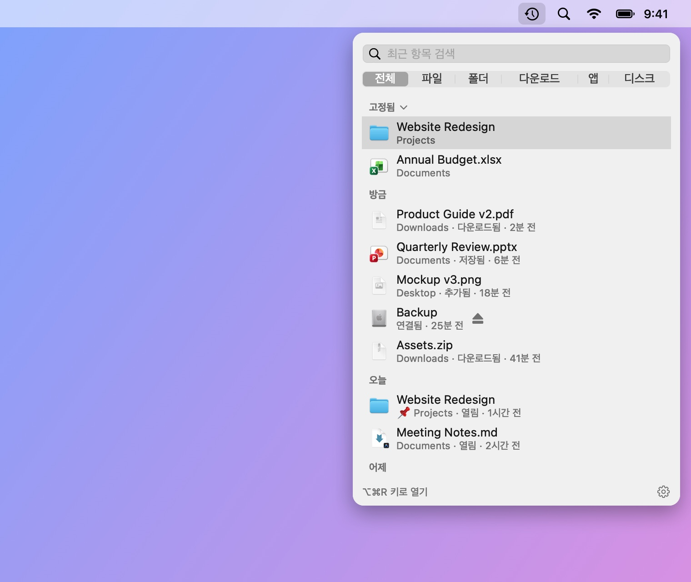
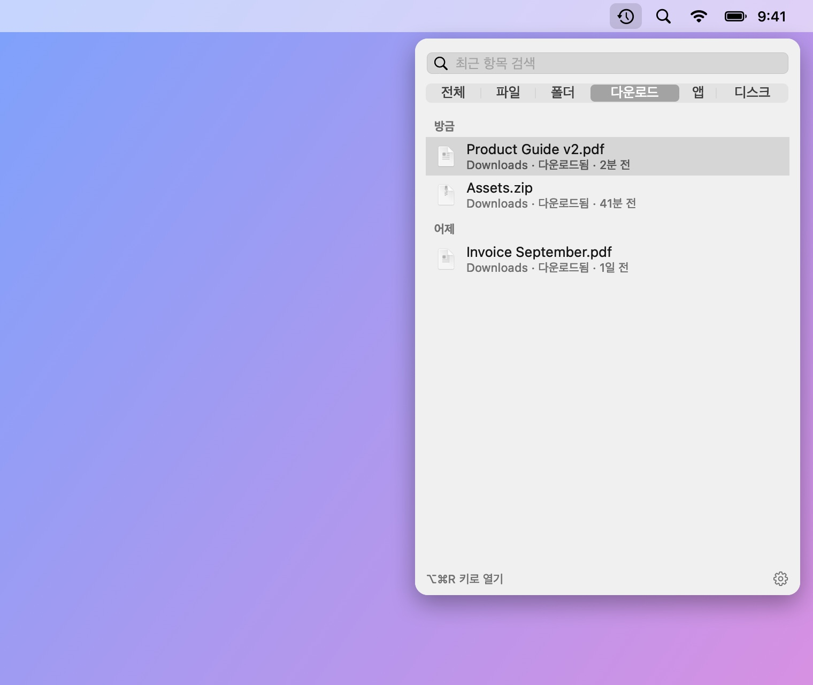
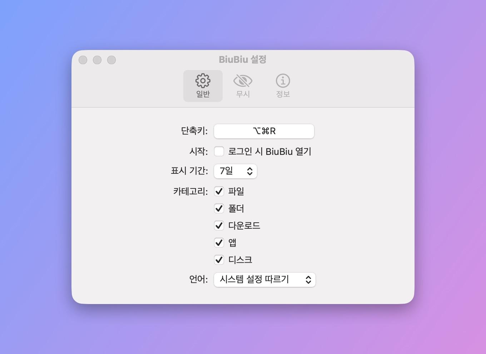

# BiuBiu

[English](README.md) · [简体中文](README_CN.md) · [繁體中文](README_TW.md) · [日本語](README_JA.md) · **한국어** · [Deutsch](README_DE.md) · [Français](README_FR.md) · [Español](README_ES.md) · [Português (Brasil)](README_PT-BR.md) · [Русский](README_RU.md)

BiuBiu는 macOS 메뉴 막대에 머무는 최근 파일 빠른 접근 앱입니다. 단축키(기본값 `⌥⌘R`)를 누르면 최근에 열거나 저장하거나 다운로드한 파일과 폴더, 최근 설치한 앱, 방금 연결한 외장 디스크가 표시됩니다. 전체 화면 앱에서도 불러올 수 있습니다.

- Spotlight 인덱스를 기반으로 모든 처리를 Mac 안에서 하며 네트워크를 쓰지 않습니다
- 클릭해서 열기, `⌘↩`로 Finder에서 보기, 스페이스 또는 `⌘Y`로 훑어보기, 다른 앱으로 바로 드래그
- 자주 쓰는 파일과 폴더를 고정하고, 보고 싶지 않은 파일·폴더·확장자는 무시 목록에 추가

<p align="center"></p>

전체 영상(영어, 소리 있음, 55초):

https://github.com/user-attachments/assets/1c2f0163-6016-40a7-a11d-a75bfeea4a53

<p align="center"></p>

<p align="center">
  
  
</p>

스크린샷의 파일은 모두 `scripts/make-screenshots.sh`로 만든 가상의 데모 데이터입니다.

## 설치

1. [Releases](../../releases/latest)에서 `BiuBiu-<버전>.zip`을 다운로드하고 압축을 풉니다.
2. `BiuBiu.app`을 응용 프로그램 폴더로 옮깁니다.
3. BiuBiu는 유료 Apple Developer ID로 서명하지 않았기 때문에 처음 실행할 때 차단됩니다. ‘완료’를 클릭한 다음 시스템 설정 → 개인정보 보호 및 보안을 열고, 아래쪽의 BiuBiu 항목에서 ‘그래도 열기’를 클릭하십시오.

   또는 터미널에서 실행: `xattr -dr com.apple.quarantine /Applications/BiuBiu.app`

4. BiuBiu가 데스크탑, 문서, 다운로드 폴더에 접근하도록 허용할지 macOS가 물으면 ‘허용’을 클릭하십시오. 허용하지 않으면 해당 폴더의 파일이 목록에 나타나지 않습니다. ‘허용 안 함’을 클릭했다면 패널 상단의 주황색 안내를 클릭해 시스템 설정에서 켤 수 있습니다.

모든 릴리스는 같은 자체 서명 인증서로 서명되므로 업데이트해도 허용한 권한이 유지됩니다.

## 요구 사항

macOS 14 이상, Apple 실리콘 또는 Intel.

## 언어

BiuBiu는 시스템 언어를 따르며, 지원하지 않는 언어일 때는 영어로 표시합니다. 지원 언어: English, 简体中文, 繁體中文, 日本語, 한국어, Deutsch, Français, Español, Português (Brasil), Русский. 다른 언어를 쓰려면 설정 → 일반 → 언어에서 선택하십시오.

## 목록이 비어 있을 때

BiuBiu는 Spotlight를 사용합니다. 시스템 설정 → Spotlight에서 홈 폴더가 검색에서 제외되어 있지 않은지 확인하십시오.

## 소스에서 빌드

Command Line Tools(`xcode-select --install`)만 있으면 되며 Xcode는 필요 없습니다.

```bash
swift run BiuBiuTestRunner   # 테스트 실행
swift run BiuBiu             # 직접 실행(영문 UI, 앱 번들 없음)
swift run BiuBiu --dump      # Spotlight가 현재 찾은 최근 항목 출력
scripts/build-app.sh         # dist/BiuBiu.app과 zip 만들기(애드혹 서명)
```

## 관리자용 안내

관리자용 안내는 [영문 README](README.md#maintainers)를 참고하십시오.

## 라이선스

MIT
