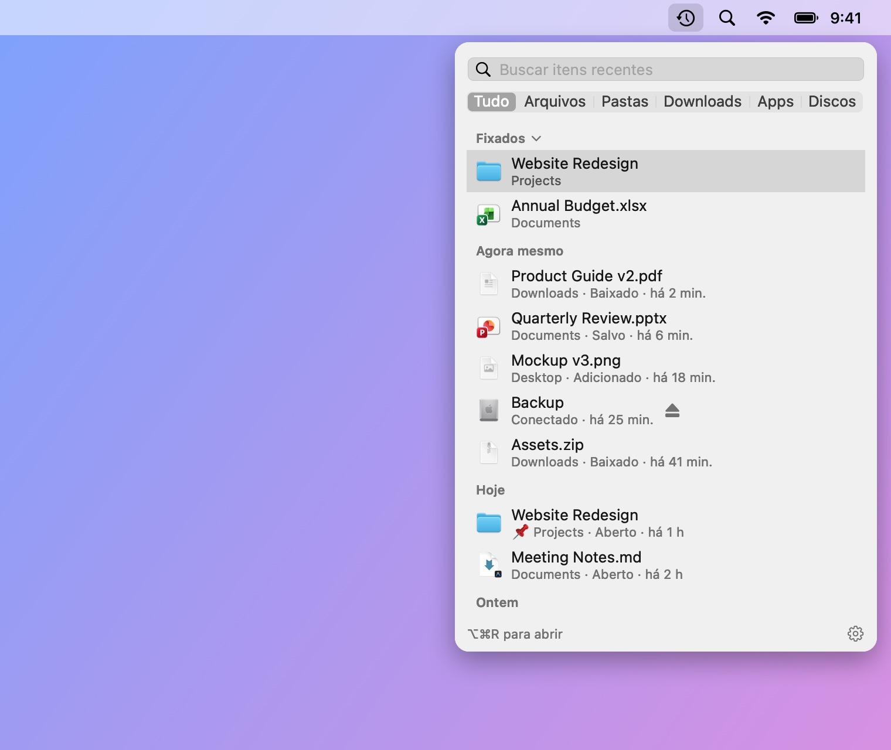
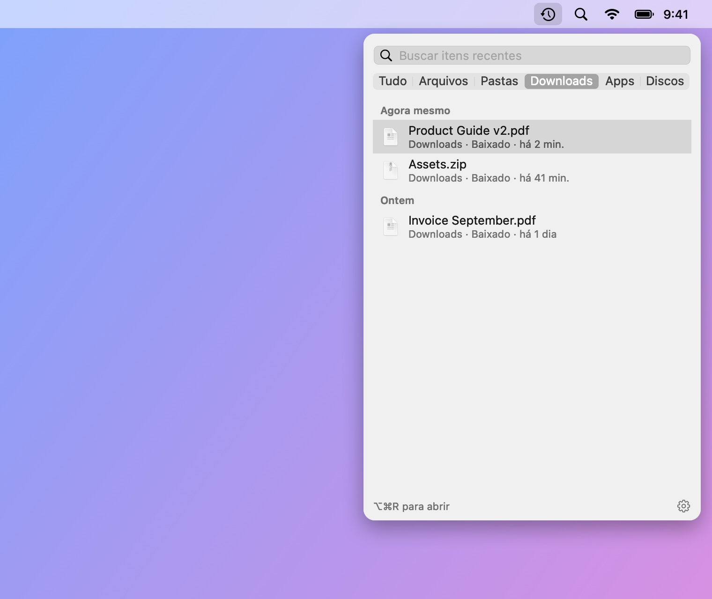
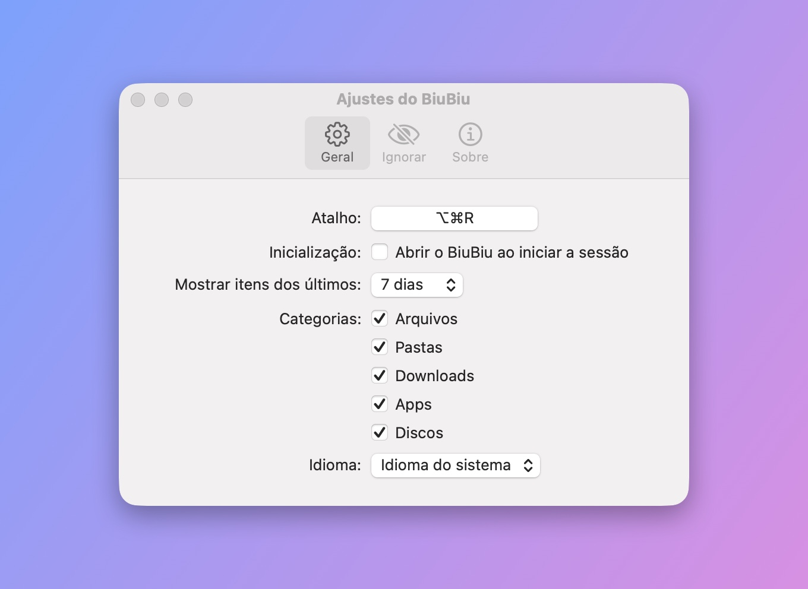

# BiuBiu

[English](README.md) · [简体中文](README_CN.md) · [繁體中文](README_TW.md) · [日本語](README_JA.md) · [한국어](README_KO.md) · [Deutsch](README_DE.md) · [Français](README_FR.md) · [Español](README_ES.md) · **Português (Brasil)** · [Русский](README_RU.md)

O BiuBiu é um app da barra de menus do macOS que mostra os arquivos e pastas que você acabou de abrir, salvar ou baixar, além de apps instalados recentemente e discos conectados. Pressione `⌥⌘R` (configurável) em qualquer lugar, até em apps em tela cheia.

- Usa o índice do Spotlight; tudo fica no seu Mac
- Clique para abrir, `⌘↩` para mostrar no Finder, Espaço ou `⌘Y` para a Visualização Rápida, ou arraste para outros apps
- Fixe seus favoritos; ignore arquivos, pastas ou extensões que você nunca quer ver

<p align="center"></p>

<p align="center">
  
  
</p>

Os arquivos destas capturas são dados de demonstração fictícios, gerados por `scripts/make-screenshots.sh`.

## Instalação

1. Baixe `BiuBiu-<versão>.zip` em [Releases](../../releases/latest) e descompacte.
2. Mova o `BiuBiu.app` para a pasta Aplicativos.
3. A primeira abertura é bloqueada porque o BiuBiu não é assinado com um Apple Developer ID pago. Clique em OK, abra Ajustes do Sistema → Privacidade e Segurança, role até o BiuBiu e clique em “Abrir Mesmo Assim”.

   Ou rode no Terminal: `xattr -dr com.apple.quarantine /Applications/BiuBiu.app`

Todas as versões são assinadas com o mesmo certificado autoassinado, então as atualizações mantêm as permissões concedidas.

## Requisitos

macOS 14 ou posterior, Apple silicon ou Intel.

## Idiomas

O BiuBiu segue o idioma do sistema e usa inglês quando ele não é compatível. Compatíveis: English, 简体中文, 繁體中文, 日本語, 한국어, Deutsch, Français, Español, Português (Brasil), Русский. Para usar outro, escolha em Ajustes → Geral → Idioma.

## Se a lista estiver vazia

O BiuBiu depende do Spotlight. Verifique em Ajustes do Sistema → Spotlight se a sua pasta pessoal não está excluída da busca.

## Compilar a partir do código

As Command Line Tools bastam (`xcode-select --install`); o Xcode não é necessário.

```bash
swift run BiuBiuTestRunner   # rodar os testes
swift run BiuBiu             # rodar diretamente (interface em inglês, sem pacote de app)
swift run BiuBiu --dump      # mostrar o que o Spotlight encontra agora
scripts/build-app.sh         # gerar dist/BiuBiu.app e um zip (assinatura ad hoc)
```

## Para mantenedores

As notas para mantenedores estão no [README em inglês](README.md#maintainers).

## Licença

MIT
