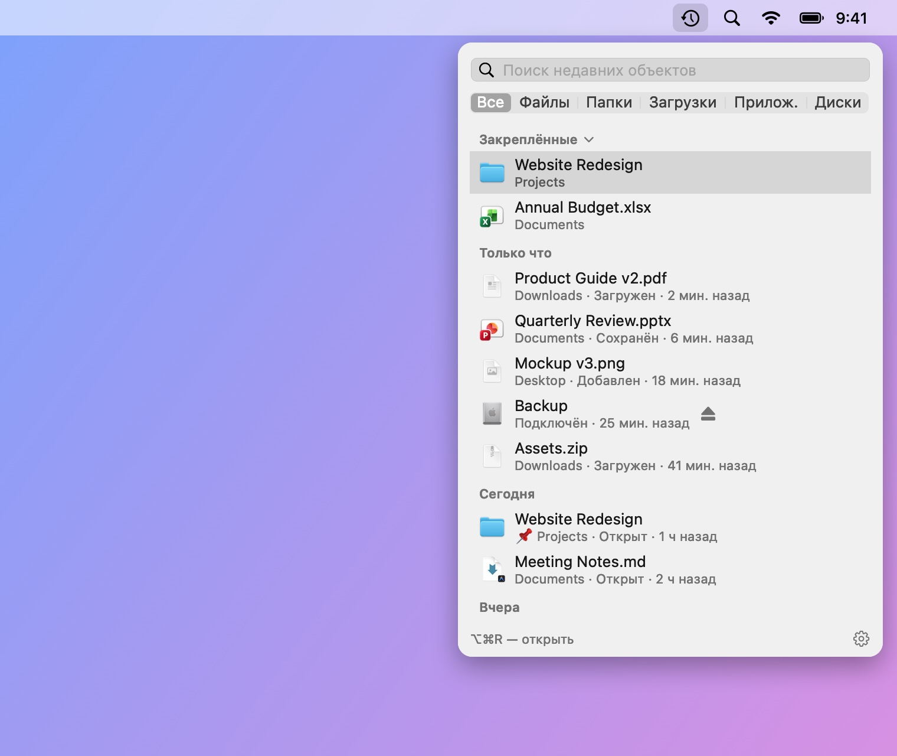
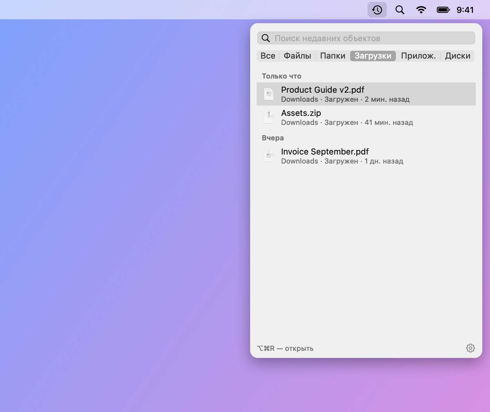
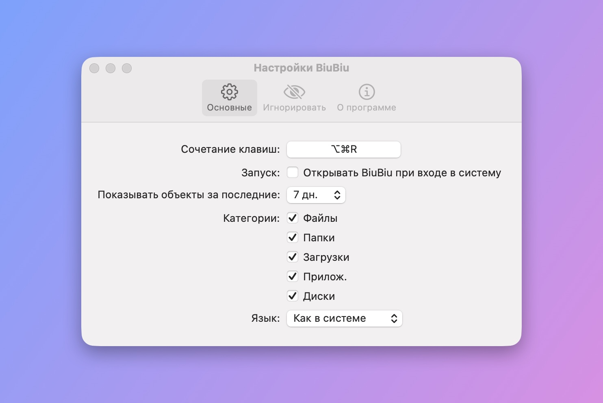

# BiuBiu

[English](README.md) · [简体中文](README_CN.md) · [繁體中文](README_TW.md) · [日本語](README_JA.md) · [한국어](README_KO.md) · [Deutsch](README_DE.md) · [Français](README_FR.md) · [Español](README_ES.md) · [Português (Brasil)](README_PT-BR.md) · **Русский**

BiuBiu — программа для строки меню macOS, которая показывает файлы и папки, которые вы только что открыли, сохранили или загрузили, а также недавно установленные программы и подключённые диски. Нажмите `⌥⌘R` (можно изменить) где угодно, даже в полноэкранных программах.

- Работает на индексе Spotlight; всё остаётся на вашем Mac
- Нажмите, чтобы открыть; `⌘↩` — показать в Finder; пробел или `⌘Y` — быстрый просмотр; перетаскивайте в другие программы
- Закрепляйте избранное; игнорируйте файлы, папки или расширения, которые не хотите видеть

<p align="center"></p>

<p align="center">
  
  
</p>

Файлы на снимках экрана — вымышленные демонстрационные данные, созданные `scripts/make-screenshots.sh`.

## Установка

1. Скачайте `BiuBiu-<версия>.zip` в разделе [Releases](../../releases/latest) и распакуйте.
2. Переместите `BiuBiu.app` в папку «Программы».
3. Первый запуск блокируется, так как BiuBiu не подписан платным Apple Developer ID. Нажмите «Готово», откройте Системные настройки → Конфиденциальность и безопасность, прокрутите до BiuBiu и нажмите «Всё равно открыть».

   Или выполните в Терминале: `xattr -dr com.apple.quarantine /Applications/BiuBiu.app`

4. Когда macOS спросит, можно ли BiuBiu обращаться к папкам «Рабочий стол», «Документы» и «Загрузки», нажмите «Разрешить», иначе файлы из них не появятся в списке. Если вы нажали «Не разрешать», нажмите оранжевую подсказку вверху панели, чтобы включить доступ в Системных настройках.

Все версии подписаны одним и тем же самоподписанным сертификатом, поэтому после обновления выданные разрешения сохраняются.

## Требования

macOS 14 или новее, Apple silicon или Intel.

## Языки

BiuBiu использует язык системы, а если он не поддерживается — английский. Поддерживаются: English, 简体中文, 繁體中文, 日本語, 한국어, Deutsch, Français, Español, Português (Brasil), Русский. Другой язык можно выбрать в Настройки → Основные → Язык.

## Если список пуст

BiuBiu использует Spotlight. Проверьте в Системные настройки → Spotlight, что ваша папка пользователя не исключена из поиска.

## Сборка из исходного кода

Достаточно Command Line Tools (`xcode-select --install`); Xcode не нужен.

```bash
swift run BiuBiuTestRunner   # запустить тесты
swift run BiuBiu             # запустить напрямую (английский интерфейс, без пакета программы)
swift run BiuBiu --dump      # показать, что сейчас находит Spotlight
scripts/build-app.sh         # собрать dist/BiuBiu.app и zip (ad-hoc подпись)
```

## Для сопровождающих

Заметки для сопровождающих — в [английском README](README.md#maintainers).

## Лицензия

MIT
