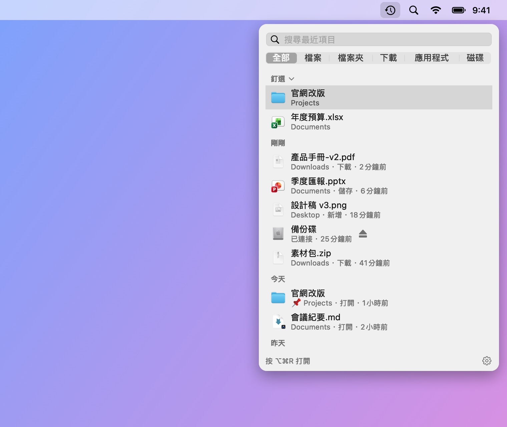
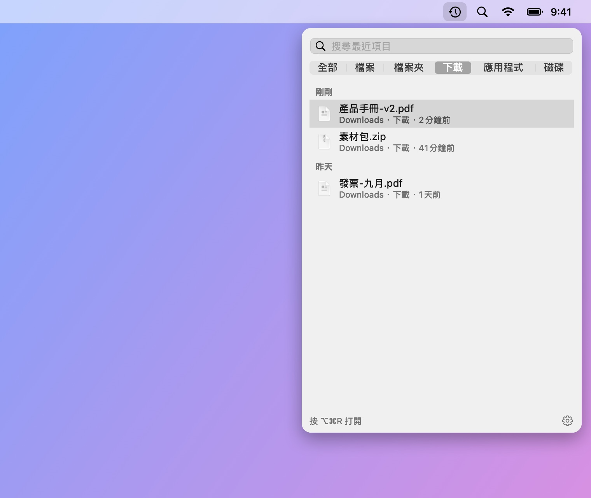
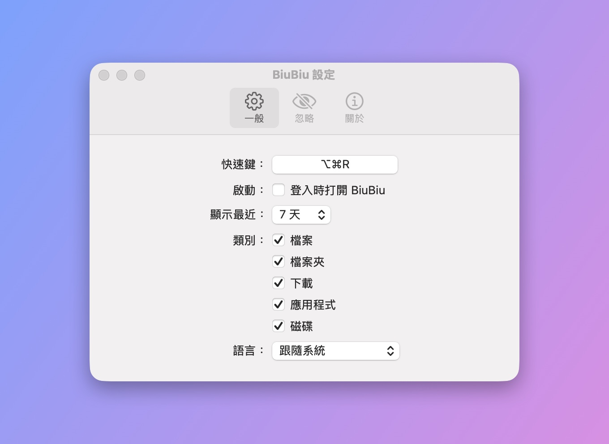

# BiuBiu

[English](README.md) · [简体中文](README_CN.md) · **繁體中文** · [日本語](README_JA.md) · [한국어](README_KO.md) · [Deutsch](README_DE.md) · [Français](README_FR.md) · [Español](README_ES.md) · [Português (Brasil)](README_PT-BR.md) · [Русский](README_RU.md)

BiuBiu 是常駐 macOS 選單列的近期檔案快速存取工具。按下快速鍵（預設 `⌥⌘R`），就能看到最近打開、儲存、下載的檔案和檔案夾，以及最近打開或安裝的應用程式和剛接上的外接磁碟。全螢幕 App 中也能叫出。

- 以 Spotlight 索引為基礎，全部在本機處理，不連網
- 按一下打開；`⌘↩` 在 Finder 中顯示；空白鍵或 `⌘Y` 快速查看；直接拖到其他 App
- 釘選常用的檔案和檔案夾；把不想看到的檔案、檔案夾或副檔名加入忽略列表

<p align="center"></p>

完整影片（英文，有聲音，55 秒）：

https://github.com/user-attachments/assets/1c2f0163-6016-40a7-a11d-a75bfeea4a53

<p align="center"></p>

<p align="center">
  
  
</p>

截圖中的檔案均為虛構的示範資料，由 `scripts/make-screenshots.sh` 產生。

## 安裝

1. 從 [Releases](../../releases/latest) 下載 `BiuBiu-<版本>.zip` 並解壓縮。
2. 把 `BiuBiu.app` 拖進「應用程式」檔案夾。
3. 第一次打開時，macOS 會提示無法驗證開發者（BiuBiu 沒有使用付費的 Apple 開發者憑證）。按「完成」，然後打開「系統設定 → 隱私權與安全性」，在頁面底部找到 BiuBiu，按「強制打開」並輸入密碼確認。

   也可以在終端機中執行： `xattr -dr com.apple.quarantine /Applications/BiuBiu.app`

4. macOS 詢問是否允許 BiuBiu 取用「桌面」「文件」「下載項目」檔案夾時，請按「允許」，否則這些檔案夾裡的檔案不會出現在列表中。如果按了「不允許」，可以按一下面板頂部的橙色提示，到系統設定裡開啟。

之後的版本都使用同一張自簽憑證，更新不會遺失已授予的權限。

## 系統需求

macOS 14 或以上版本，Apple 晶片或 Intel。

## 語言

BiuBiu 跟隨系統語言，系統語言不受支援時顯示英文。支援：English, 简体中文, 繁體中文, 日本語, 한국어, Deutsch, Français, Español, Português (Brasil), Русский。若要使用其他語言，可在「設定 → 一般 → 語言」中選擇。

## 如果列表是空的

BiuBiu 依賴 Spotlight。請在「系統設定 → Spotlight」中確認個人專屬檔案夾沒有被排除在搜尋之外。

## 從原始碼建置

只需要 Command Line Tools（`xcode-select --install`），不需要 Xcode。

```bash
swift run BiuBiuTestRunner   # 執行測試
swift run BiuBiu             # 直接執行（介面為英文，沒有 App 套件）
swift run BiuBiu --dump      # 列出 Spotlight 目前找到的最近項目
scripts/build-app.sh         # 打包 dist/BiuBiu.app 和 zip（臨時簽署）
```

## 維護者說明

維護者說明請見 [英文版 README](README.md#maintainers)。

## 授權

MIT
